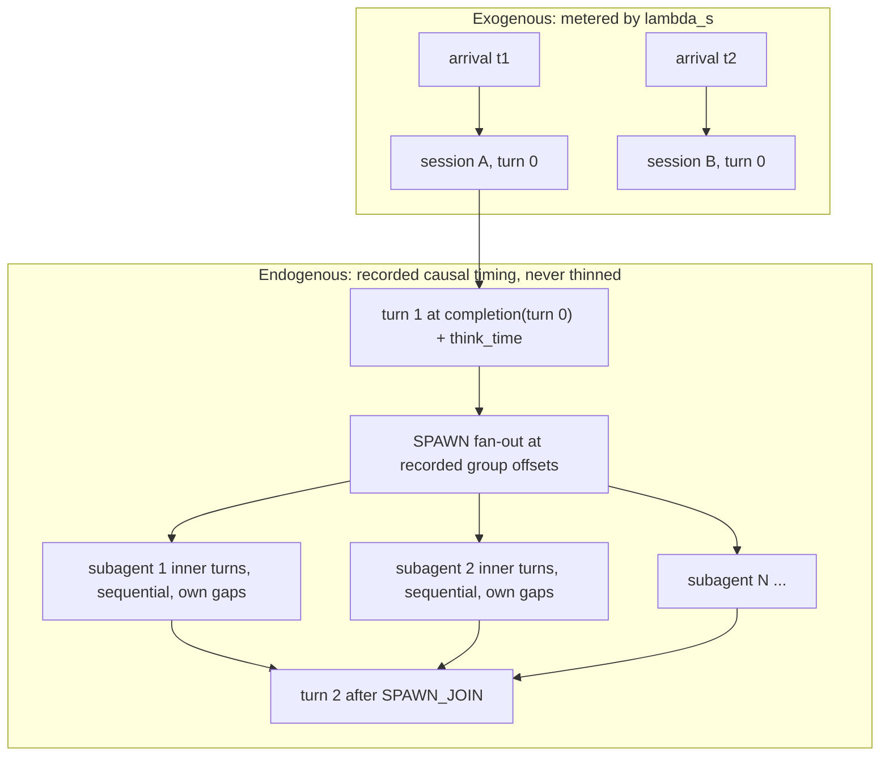

<!--
SPDX-FileCopyrightText: Copyright (c) 2026 NVIDIA CORPORATION & AFFILIATES. All rights reserved.
SPDX-License-Identifier: Apache-2.0
-->

# Open-Loop Session Arrivals

`--session-arrival-rate` switches the `agentic_replay` timing mode from its
default closed loop to an open loop: session **starts** are generated by an
exogenous arrival process at rate `lambda_s` and are independent of
completions. Everything a session does after it is admitted keeps its recorded
causal timing and is never metered by the arrival rate.

---

## Closed Loop vs Open Loop

| | Closed loop (default) | Open loop (`--session-arrival-rate`) |
|---|---|---|
| Session population | Exactly `--concurrency` lanes, held occupied for the whole phase | Random variable set by `lambda_s` x mean session residence time |
| New session trigger | A lane's trace tree drains, so the lane recycles | An arrival instant fires |
| Effect of a slow server | Fewer sessions per unit time; population stays constant | Population grows; offered load is unchanged |
| Trajectory start | Each lane snapshots its trace at a random t\* and resumes there | Every session replays its trace from turn 0 |
| Warmup | A t\* snapshot warmup phase is synthesized | None is synthesized (there is no snapshot to prime) |
| `--concurrency` | Mandatory; it *is* the lane count | Optional; an admission ceiling |

Use the open loop when the question is "what happens to latency as offered
load rises", which requires the arrival process to be independent of the
system under test. Use the closed loop when the question is "what throughput
does this system sustain at a fixed session population".

---

## What Is and Is Not Metered

Only session starts ride the arrival clock:



A recorded 5-request simultaneous fan-out is dispatched as a 5-request
simultaneous fan-out at every value of `lambda_s`. Main-turn continuations fire
at `completion(turn k) + recorded think time`; subagent groups fire at their
recorded offset from the parent's completion; subagent inner turns run
sequentially at their own recorded gaps. None of these consume arrival ticks.

---

## Flags

| Flag | Type | Default | Meaning |
|---|---|---|---|
| `--session-arrival-rate <lambda>` | float > 0 | unset (closed loop) | Sessions started per second. |
| `--session-arrival-pattern <p>` | `poisson` \| `constant` \| `gamma` | `poisson` | Inter-arrival distribution. `concurrency_burst` is rejected: it produces a zero inter-arrival time and would ignore the rate. |
| `--session-arrival-smoothness <k>` | float > 0 | unset | Gamma shape. `1.0` is Poisson-equivalent, `<1.0` is burstier, `>1.0` is more regular. Only read when the pattern is `gamma`. |

`--session-arrival-pattern` and `--session-arrival-smoothness` require
`--session-arrival-rate`; passing either alone is rejected rather than dropped.

In YAML the three flags collapse into one `session_arrival` section on the
profiling phase:

```yaml
session_arrival:
  rate: 0.4         # required; presence of the section opens the loop
  pattern: gamma    # optional, default poisson
  smoothness: 0.5   # optional, gamma only
```

These are distinct from `--request-rate` / `--arrival-pattern`, which meter
*requests*. Under `agentic_replay`, request-level metering would thin
continuation turns and subagent fan-out along with session starts, which
destroys the recorded intra-session concurrency.

The flags are `agentic_replay` only. Setting `--session-arrival-rate` under any
other timing mode is rejected at startup rather than silently ignored.

---

## Example

`agentic_replay` has no direct CLI flag. Select it with an explicit phase
override in YAML:

```yaml
phases:
  - type: profiling
    timing_mode: agentic_replay
    session_arrival:
      rate: 0.4
    benchmark_duration: 1800
```

```bash
aiperf profile \
    --config open-loop.yaml \
    --url localhost:8000 \
    --model claude-opus-4-5-20251101 \
    --model claude-haiku-4-5-20251001 \
    --endpoint-type chat \
    --streaming \
    --public-dataset semianalysis_cc_traces_weka_with_subagents \
    --cache-bust first_turn_prefix
```

`--session-arrival-rate 0.4` on the command line is equivalent to the YAML
section; it routes to the profiling phase.

---

## Sizing `lambda_s`

By Little's law the expected in-system session count is
`E[N] = lambda_s * E[R]`, where `E[R]` is the mean wall-clock residence time of
one full trace replay (all main turns, all subagent groups, all inter-turn
think time). Residence time on real agentic-coding corpora is dominated by
recorded think time, not by server latency, so `E[R]` is largely a property of
the corpus. Measure it with one closed-loop run at low concurrency, then pick
`lambda_s` for the session population you want.

Two run-level knobs interact with `E[R]`:

- `--use-think-time-only` removes the previous server's response time from
  every inter-turn gap, which shortens `E[R]`.
- `--system-idle-gap-cap-seconds` pulls all pending timers forward when the
  replay is globally idle. Under open-loop arrivals the inter-arrival dead air
  is itself idle time, so this cap compresses the arrival process as well as
  intra-session gaps and makes the realized rate exceed `lambda_s`. Leave it
  unset unless you specifically want that compression.

---

## Admission Ceiling and Overload

`--concurrency` is optional in this mode. When set, it caps the number of
concurrently live sessions:

- An arrival that finds no free session slot is **rejected and counted**, not
  queued. Queuing would make the realized in-system session count a function of
  the server's speed, which is exactly the closed-loop behavior the open loop
  exists to avoid.
- The first rejection logs a warning naming the ceiling; subsequent rejections
  are counted silently.
- The phase-end log line reports the full accounting:

  ```
  Session arrivals: pattern=poisson rate=0.4/s, generated=712 admitted=690
    rejected_overload=22 rejected_unspawnable=0 behind_schedule_resets=3
  ```

  A nonzero `rejected_overload` means the realized arrival process is truncated
  and no longer matches the requested `lambda_s`. Raise `--concurrency`, drop it
  for an uncapped open loop, or lower `--session-arrival-rate`.
  `behind_schedule_resets` counts instants where admission work ran past the
  next scheduled arrival; a large value relative to `generated` means the
  arrival loop itself is the bottleneck.

Leaving `--concurrency` unset gives an uncapped open loop. That is the faithful
configuration for a load-vs-latency curve, and it will queue without bound past
the saturation point, so pair it with `--benchmark-duration` and a
`--failed-request-threshold`.

---

## Cache-Bust Is Effectively Required

Arrivals draw traces from the shared dataset sampler, so with
`sampling_strategy: random` the corpus is sampled **with replacement** and a
long run replays the same trace many times. With `cache_bust.target=none`,
every replay after the first reuses the previous one's prompt prefix and
inflates the measured prefix-cache hit rate.

Pass `--cache-bust first_turn_prefix`. AIPerf emits a warning at PROFILING
start when open-loop arrivals are combined with `cache_bust.target=none`.

Each arrival gets a distinct marker: the cache-bust digest is salted with the
monotonic session ordinal of the arrival, so replay instance *n* and replay
instance *m* of the same trace occupy different cache namespaces and carry
different `X-Session-ID` values. Within one arrival, the depth-0 root and every
subagent descendant share one marker, so a tree is still a single prefix-cache
domain.

---

## Warmup

No t\* snapshot warmup is synthesized in this mode, and user-declared warmup
phases are skipped under `agentic_replay` as they are in the closed loop. The
run therefore starts with an empty system and reaches steady state after
roughly one mean session residence time. Size `--benchmark-duration` well
beyond `E[R]`, or discard the leading interval when analyzing results.

---

## Scenario Interaction

`--scenario inferencex-agentx-mvp` fixes the closed-loop concurrency-lane load
model and rejects `--session-arrival-rate`. The load model is part of that
submission protocol, so an open-loop run is not comparable to a conforming one.
`--unsafe-override` downgrades the rejection to a warning and stamps
`submission_valid: false`.

---

## Related

- [Load Generator Options Reference](timing-modes-reference.md)
- [Replaying Agentic Coding Sessions with Weka Traces](../tutorials/weka-trace.md)
- [InferenceX AgentX MVP](../tutorials/agentx-mvp.md)
- [Conversation DAG Benchmarks](dag.md)
