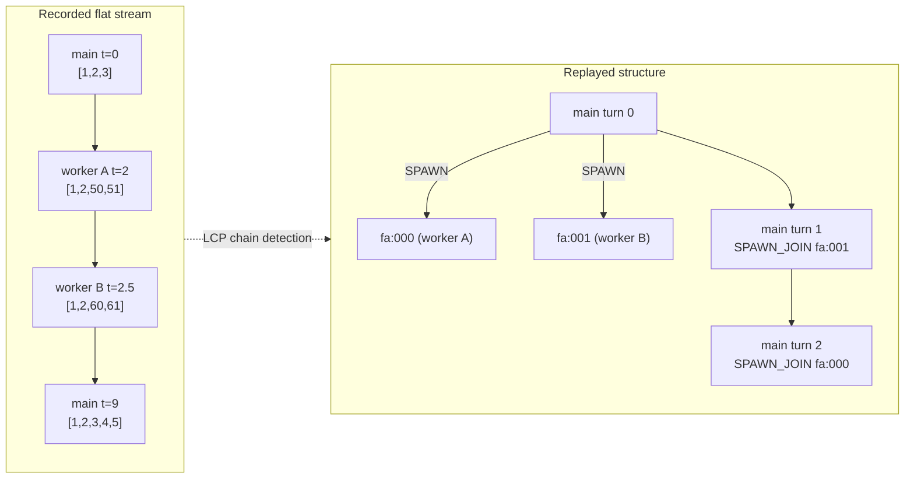

<!--
SPDX-FileCopyrightText: Copyright (c) 2026 NVIDIA CORPORATION & AFFILIATES. All rights reserved.
SPDX-License-Identifier: Apache-2.0
-->

# Replaying Agentic Coding Sessions with Weka Traces

Benchmark your LLM inference server with real-world agentic coding sessions captured via the [Weka KV-Cache-Tester](https://github.com/callanjfox/kv-cache-tester) research project. These traces preserve per-request timing, cache-block hash IDs (for KV-cache-aware replay), and nested subagent topology.

> **Looking for the SemiAnalysis InferenceX AgentX-MVP submission flow?** That benchmark is built on this corpus with extra rules locked in. See [InferenceX AgentX MVP](agentx-mvp.md) — the scenario preset (`--scenario inferencex-agentx-mvp`) bundles the AgentX rules into a single flag on top of the loader documented here.

---

## What Is a Weka Trace?

Each trace file is a single JSON object describing one coding conversation:

- `requests` is an ordered list of normal API calls (`type: "n"`), streaming API calls (`type: "s"`), and subagent markers (`type: "subagent"`).
- Each normal/streaming request carries `hash_ids` (KV-cache block identifiers) used to simulate cache reuse during replay.
- Subagent markers point at nested sub-conversations — AIPerf replays them as separate concurrent child sessions that the parent waits on before resuming.

AIPerf maps the format directly onto its DAG datastructure:

- One root `Conversation` per trace file.
- One or more child `Conversation`s per `type: "subagent"` entry. The same hash-id LCP chain detection used for flat top-level fan-outs (see below) runs nested on each subagent's inner requests: the subagent's own thread keeps session id `<trace_id>::sa:<agent_id>`, and every detected inner chain (a one-shot disjoint call, a parallel fork of the subagent's context, or a flattened worker thread) becomes a sibling child with `<trace_id>::sa:<agent_id>:fa:000`, `:fa:001`, ... (or `:wg:`/`:aux:` per the classification below) — each dispatched at its recorded offset from the spawn. Inner requests without `hash_ids` stay on the subagent's main chain in time order.
- A `SPAWN` branch on the parent's preceding turn; a `SPAWN_JOIN` prerequisite on the parent's following turn. Three nuances: (a) subagents with no preceding parent turn are dropped (logged at load time); (b) subagents with no following parent turn become `is_background=True` branches with no `SPAWN_JOIN` prerequisite (the parent doesn't wait); (c) adjacent subagents sharing the same `(preceding, following)` anchors collapse into one multi-child branch.

---

## Quick Start

```bash
aiperf profile \
    --url localhost:8000 \
    --model claude-opus-4-5-20251101 \
    --model claude-haiku-4-5-20251001 \
    --endpoint-type chat \
    --streaming \
    --input-file artifacts/kv-cache-tester/traces/ \
    --fixed-schedule
```

Whatever you pass to `--model` becomes the model the server actually sees. Trace requests are rewritten to use your configured model(s) — the trace's recorded model names don't have to match what you're serving. See [Per-Trace Model Rewriting](#per-trace-model-rewriting) below for how multi-model traces map onto multiple `--model` values.

The `--fixed-schedule` flag replays requests at their recorded timestamps; subagents run in parallel and the parent's next turn waits until they complete.

### Directory vs Single File

Both work:

```bash
# Directory of trace JSON files
aiperf profile ... --input-file artifacts/kv-cache-tester/traces/

# Single trace
aiperf profile ... --input-file artifacts/kv-cache-tester/traces/trace_0001.json
```

### Filtering

Standard trace filters apply:

- `--synthesis-max-isl <N>`: drop any request whose input length exceeds N tokens. Subagents whose preceding parent turn is filtered out are dropped; subagents whose only-following parent turn is filtered out fall back to background branches (no anchor turn to wait on).
- `--synthesis-max-osl <N>`: cap any request's `max_tokens` to N.
- `--fixed-schedule-start-offset` / `--fixed-schedule-end-offset`: time window on the outer `t` field.

---

## Loading From HuggingFace (No Download Required)

If you don't already have the trace corpus on disk, SemiAnalysis-published HuggingFace mirrors are available and can be pulled directly by AIPerf with a single flag:

- [`semianalysisai/cc-traces-weka-no-subagents-051826`](https://huggingface.co/datasets/semianalysisai/cc-traces-weka-no-subagents-051826) — pinned no-subagents current corpus: 98 traces, **main-agent only** (all `WekaSubagentEntry` blocks stripped at publication time). This is also the legacy/default target for the plain `semianalysis_cc_traces_weka` alias.
- [`semianalysisai/cc-traces-weka-061526`](https://huggingface.co/datasets/semianalysisai/cc-traces-weka-061526) — pinned historical full-context corpus (alias `semianalysis_cc_traces_weka_061526`): 233 v7 traces with full subagent fan-out.
- [`semianalysisai/cc-traces-weka-061526-256k`](https://huggingface.co/datasets/semianalysisai/cc-traces-weka-061526-256k) — 232-trace historical 256k-capped sibling (alias `semianalysis_cc_traces_weka_061526_256k`).
- [`semianalysisai/cc-traces-weka-062126`](https://huggingface.co/datasets/semianalysisai/cc-traces-weka-062126) — pinned current full-context corpus (alias `semianalysis_cc_traces_weka_062126`): 393 v7 traces with full subagent fan-out (parent + child SPAWN/JOIN topology). This is the canonical AgentX MVP corpus.
- [`semianalysisai/cc-traces-weka-062126-256k`](https://huggingface.co/datasets/semianalysisai/cc-traces-weka-062126-256k) — 393-trace 256k-capped sibling (alias `semianalysis_cc_traces_weka_062126_256k`). Requests over the cap are filtered while surviving relative timestamps and subagent overlap are preserved.

```bash
aiperf profile \
    --url localhost:8000 \
    --model claude-opus-4-5-20251101 \
    --model claude-haiku-4-5-20251001 \
    --endpoint-type chat \
    --streaming \
    --public-dataset semianalysis_cc_traces_weka_with_subagents \
    --fixed-schedule
```

Use `semianalysis_cc_traces_weka_no_subagents` if you want the main-agent-only corpus instead. The plain `semianalysis_cc_traces_weka` tag is a legacy/default pinned alias for the current no-subagents corpus.

On first run, the full corpus downloads upfront and is cached locally by the HuggingFace `datasets` library; subsequent runs reuse the cache. Both datasets are public — no HuggingFace authentication or token is required.

> **`--num-dataset-entries` is optional for Weka loaders.** When omitted, the HF Weka loader automatically loads the full corpus and logs `Loading all <total> traces` at INFO. Pass an explicit value only when you want a subset — the loader will log `Loading <n>/<total> traces` so you can see the cap in effect. (The file-based `--input-file <dir>` path always loads every JSON file it finds; the same auto-full behavior applies.)

The HuggingFace path and the file-based `--input-file` path produce **byte-identical conversations** for the same source rows because the public-dataset loader is a thin wrapper that delegates 100% of trace reconstruction (hash_id replay, per-trace model mapping, branch + spawn-join topology, delay capping, parallel reconstruction) to the same `WekaTraceLoader.convert_to_conversations()` used by `--input-file`. There is one source of truth for trace reconstruction.

### File-Based vs HuggingFace: Which to Use

| Path | When to use |
|---|---|
| `--input-file <dir-or-file>` (file-based) | You already have a local trace directory, you need offline runs (no outbound network), or you're developing/debugging the loader against a specific subset of traces. |
| `--public-dataset semianalysis_cc_traces_weka_no_subagents` (HuggingFace, no subagents) | Pinned no-subagents current corpus for benchmarks where you want a single linear agent stream per trace and don't care about parent/child fan-out. 98 traces. |
| `--public-dataset semianalysis_cc_traces_weka` (HuggingFace, legacy/default no-subagents alias) | Legacy/default pinned alias for the same current no-subagents corpus as `semianalysis_cc_traces_weka_no_subagents`. |
| `--public-dataset semianalysis_cc_traces_weka_with_subagents` (HuggingFace, with subagents) | Rolling with-subagents alias tracking the current default corpus (062126) for zero-setup runs with full subagent SPAWN/JOIN topology. 393 traces. |

Existing Weka tunables work identically in both paths: `--synthesis-max-isl`, `--synthesis-max-osl`, `--inter-turn-delay-cap-seconds`, `--trace-idle-gap-cap-seconds`, `--ignore-trace-delays`, `--use-think-time-only`, `--cache-bust`, the per-trace model rewriting rules below — same flags, same behavior, same output bytes on the wire. For `--scenario inferencex-agentx-mvp`, the validator accepts a with-subagents `--public-dataset` alias or `weka_hf` constrained to `semianalysisai/cc-traces-weka-062126` for `submission_valid: true`; a local `weka_trace` directory requires `--unsafe-override` (stamps `submission_valid: false`) because corpus identity is not fingerprintable; it does not accept the no-subagents aliases. That scenario forbids per-turn and per-trace delay caps, preserves the original Weka timeline, and uses only the global `--system-idle-gap-cap-seconds` guard.

For newly published compatible HuggingFace Weka trace corpora, pass `--hf-weka-dataset <repo>` — it auto-selects the neutral `weka_hf` loader (passing `--public-dataset weka_hf` explicitly is equivalent):

```bash
aiperf profile \
    --model Qwen/Qwen3-0.6B \
    --endpoint-type chat \
    --hf-weka-dataset semianalysisai/cc-traces-weka-062126 \
    --streaming \
    --url localhost:8000
```

Use the pinned `semianalysis_cc_traces_weka...` aliases, including the plain `semianalysis_cc_traces_weka` alias, when you want the exact corpus named by that alias. Use `weka_hf` when testing a new compatible `semianalysisai/cc-traces-weka-*` release before deciding whether it deserves a pinned alias. For AgentX MVP runs, generic `weka_hf` is valid only with `--hf-weka-dataset semianalysisai/cc-traces-weka-062126`; other `weka_hf` repos are rejected by the scenario validator.

A tokenizer is required in both paths (the prompt is reconstructed from `hash_ids`); pass `--tokenizer <name-or-path>` if your `--model` doesn't resolve a default tokenizer.

---

## Replay Timing Controls

By default, AIPerf auto-enables `--fixed-schedule` for trace datasets — turns are sent at their recorded timestamps, subagents run in parallel, and the parent waits on `SPAWN_JOIN`. The Quick Start above is what you want for most cases.

If you need different replay pacing, several flags are available (recent additions, all weka-trace-aware):

| Flag | What it does |
|---|---|
| `--no-fixed-schedule` | Opt out of the auto-enabled fixed-schedule. Turns dispatch at whatever pace your other timing flags imply (concurrency, request rate, `agentic_replay`, etc.) instead of the recorded `t` timestamps. |
| `--ignore-trace-delays` | Strip per-turn timestamps and inter-turn delays at load time — every turn becomes back-to-back. Mutually exclusive with `--use-think-time-only`. |
| `--use-think-time-only` | Inter-turn delay uses only the trace's recorded `think_time` (client-side wait before each request), not `t_curr - t_prev` (which would include the original server's response time). Useful when your server is faster or slower than the recording — you don't want it punished or rewarded for the *previous* server's latency. Mutually exclusive with `--ignore-trace-delays`. |
| `--inter-turn-delay-cap-seconds <S>` | Clamp any single inter-turn delay to at most `S` seconds. Defaults to `None` (no clamp); pass `60` to cap "coffee-break" gaps in real coding traces. |

`--no-fixed-schedule` only opts out of auto-promotion of fixed schedule for
trace datasets. If you also pass explicit `--fixed-schedule`, fixed schedule
still wins (both flags can be set; there is no startup mutex error).

### `agentic_replay` Timing Mode

For multi-turn steady-state benchmarking with sampler-driven recycle (honors
`sampling_strategy`) and trajectory-based warmup (the agent-load-generation
pattern AgentX MVP requires), AIPerf has a dedicated timing mode: `agentic_replay`. It is **scenario-locked** — there is no direct CLI flag to select it. Pass `--scenario inferencex-agentx-mvp` (the only built-in scenario that pins this mode today) and AIPerf's scenario validator sets `timing_mode=agentic_replay` for you:

```bash
aiperf profile \
    --scenario inferencex-agentx-mvp \
    --input-file artifacts/kv-cache-tester/traces/ \
    --custom-dataset-type weka_trace \
    --unsafe-override \
    --concurrency 50 \
    --benchmark-duration 900 \
    ...
```

Local `weka_trace` under the scenario always needs `--unsafe-override`
(stamps `submission_valid: false`). For a valid submission, use a pinned
`--public-dataset` with-subagents alias instead — see [InferenceX AgentX MVP](agentx-mvp.md).

For the full mechanics (trajectory selection, recycle queue, warmup barrier) and the locked submission rules on top, see [InferenceX AgentX MVP](agentx-mvp.md).

#### Open-Loop Session Arrivals

`agentic_replay` is closed loop by default: `--concurrency` trajectory lanes are
held occupied for the whole phase and a drained lane immediately recycles.
`--session-arrival-rate <lambda>` switches the profiling phase to an open loop
instead: session starts come from a Poisson (or gamma / constant) arrival
process, so the in-system session count follows from the rate and the mean
session residence time rather than being pinned to `--concurrency`. Only
session starts are metered: main-turn continuations, subagent fan-out groups
and subagent inner turns keep their recorded causal timing. This is the
configuration for a load-vs-latency curve over a trace corpus. See
[Open-Loop Session Arrivals](../benchmark-modes/open-loop-session-arrivals.md).

### Cache-Bust Markers

AIPerf can inject a unique per-play marker according to the `--cache-bust`
target (`system_*` / `first_turn_*`), so recycled plays of the same trace
produce different prompt bytes and don't progressively warm the server's
KV-cache prefix as the run goes on. Pass `--cache-bust system_prefix` (or
`system_suffix` / `first_turn_prefix` / `first_turn_suffix`) to enable it.
The default is `none` (no marker injected).

The marker looks like `[rid:8a3f2c1b9e7d]` and is derived deterministically within a run from the auto-generated benchmark ID, the trace's recycle count, the trajectory index, and the trace ID — same trace, same recycle pass, same marker for every turn in that play. Markers differ across runs (the benchmark ID is a fresh UUID each time).

This is locked on for the AgentX MVP scenario — auto-injected as `first_turn_prefix` when you don't pass `--cache-bust` yourself, and any explicit conflicting value is rejected at startup. Outside that scenario it's optional and defaults to `none`.

A few details worth knowing if you're using `--cache-bust` outside the scenario:

- **Compatibility is checked at startup.** `--cache-bust` works with every timing mode when endpoint plugin metadata sets `supports_cache_bust=true` (currently `--endpoint-type chat`, `responses`, or Anthropic `messages`). Other endpoint types error before the run starts with a message naming the offending flag, rather than silently dropping the marker.
- **Multimodal turns are supported.** When a turn carries images or audio alongside text, the marker is added as a new `{type: "text", text: "<marker>"}` content part at the start (prefix) or end (suffix) of the parts list; existing text/image/audio parts pass through untouched.
- **`system_*` falls back to the first user turn when there's no system message.** If a trace has no system role anywhere (neither a conversation-level system message nor a `raw_messages[0].role=='system'`), `--cache-bust system_prefix` and `system_suffix` route the marker to the first user turn with the same orientation (prefix stays prefix, suffix stays suffix). Like `first_turn_*`, that injection runs on every credit and is idempotent (it will not stack the marker). A one-shot WARN is logged when the session has an empty `turn_list` and the marker cannot be placed at all.
- **Incompatible with `payload_bytes` workloads.** AIPerf's pre-encoded mmap fast path bypasses the per-request rendering that injection needs. If your dataset would otherwise pick the `PAYLOAD_BYTES` format, AIPerf refuses the run with a clear error rather than silently dropping markers. Either drop `--cache-bust` or use a workload that goes through the normal compose path.

If you're tracking how the marker contributes to the **wire-token total** the model actually sees, see [Input Sequence Length (ISL) Tokenization](../reference/isl-tokenization.md). With `--apply-chat-template`, AIPerf compensates the synthetic prompt budget for the marker's token cost so `--isl N` lands on `N` tokens at the wire after the chat template wraps it.

---

## Per-Trace Model Rewriting

The WEKA corpus was captured against specific models (typically Claude Opus for the agent and Claude Haiku for subagents). You don't have to serve those exact models to replay it. AIPerf rewrites every request's `model` field at load time to whatever you pass via `--model`.

The mapping is built **per trace**, in this order:

1. The trace's **main model** — the `model` of the first parent (non-subagent) request, falling back to the first request of the first subagent for parent-less traces — maps to your **first** `--model`.
2. Other distinct models in the trace map to your **second**, **third**, … `--model` in **first-appearance order**.
3. If a trace has more distinct models than you passed `--model` values, the mapping wraps with modulo (so every request still resolves to one of your configured models).

Practical implications:

- **One `--model`**: every request — parent, subagents, all of it — gets routed to that one model.
- **Two `--model` values**: a typical Opus-parent + Haiku-subagent trace replays with parent → first model, subagent → second model. Same shape as the recording, just relabeled.
- **Multi-model traces against fewer configured models**: extras reuse the configured list from the start. This is intentionally lossy (you asked for fewer routes) but the run still completes.
- **Trace's own `models` list is ignored** — the mapping is built from per-request `model` fields, not the trace-level metadata field.

The mapping is rebuilt for every trace independently, so a corpus with mixed-model and single-model traces all work side-by-side under one `--model` set.

---

## What Gets Replayed

Per turn:

- **Prompt** is synthesized deterministically from the recorded `hash_ids` via the shared `hash_ids -> token sequence -> decoded prompt` pipeline, so cache structure is preserved across runs.
- **Model** is rewritten via a per-trace mapping (see [Per-Trace Model Rewriting](#per-trace-model-rewriting)) — the trace's per-request `model` field is used to *pick which* configured model gets sent for that request, not as the routing model itself.
- **Max tokens** comes from the `out` field (after `--synthesis-max-osl` capping).
- **Timing** preserves the recorded `t` field for `--fixed-schedule`. By default, inter-turn `delay` is computed as `t_n - t_{n-1}`. With `--use-think-time-only`, `delay` instead uses the recorded per-request `think_time`. With `--ignore-trace-delays`, both `timestamp` and `delay` are stripped at load time. See [Replay Timing Controls](#replay-timing-controls) above.
- **Input kind** classifies what produced each turn's new input, surfaced as `Turn.input_kind` (`tool_result` or `user_input`). The own-turn `input_types` field decides when recorded (a `tool_result` membership marks a machine-paced agentic-loop continuation; `text`/multimodal marks genuine user/agent input); otherwise the previous request's `stop` reason is the fallback (`tool_use` is always answered by a tool result). Traces recorded before these fields existed classify as `None` and replay exactly as before.
- **Tool-shaped messages** (opt-in, `AIPERF_DATASET_WEKA_TOOL_SHAPED_MESSAGES=true`): turns classified `tool_result` are sent in the OpenAI tool-call wire shape -- the same-delta assistant message carries a synthetic `tool_calls` entry and the turn's new input becomes a `role: "tool"` message (content text unchanged). Exercises the server's tool-message chat-template path at the cost of exact ISL fidelity, since tool messages tokenize differently than plain user text. Turn 0 falls back to the plain user shape automatically; legacy traces without the tool signal are unaffected. Shaping is decided once, at the turn's first emission: a `reset_context` full re-emission reproduces exactly the shape (and synthetic call id) each turn was first sent with, never reshaping already-sent context.

The trace's recorded `type: "s"` (streaming) vs `type: "n"` (non-streaming) is independent of how AIPerf sends the request — the transport is controlled by `--streaming`. Both types are replayed identically.

---

## Flattened-Agent Detection

Many captures record parallel agent fan-outs (e.g. Workflow-tool agents, which carry no agent-id header) as **flat top-level requests** interleaved with the real main agent's turns, instead of nested `type: "subagent"` entries. Replaying that stream as one conversation collapses the recorded concurrency and forces context resets at every interleave boundary.

The loader detects these hidden agents from `hash_ids` longest-common-prefix (LCP) evidence and splits them into per-agent child conversations:

- **Chain**: a request whose hash list fully extends a chain's tail, starts after that tail's interval ends, and runs on the same model is that agent's next turn.
- **Join seam**: a request that keeps only a prefix of a tail (compaction / context edit) is the same agent's continuation **iff** the longer state is never touched again — otherwise:
- **Spawn**: the request is a separate agent forked from the shared prefix and becomes a child conversation linked with SPAWN/SPAWN_JOIN like a proper subagent. Each spawned chain is then **classified** to choose its session-id marker:
  - `<trace_id>::fa:NNN` — a solo agent (the default).
  - `<trace_id>::wg:{group}_{member}` — a **parallel worker-group** member: a coordinated parallel fan-out requires BOTH a shared spawned context AND actual concurrency. Workers that forked from shared context (`fork.depth > 0`) are scoped by their fork point (`fork.parent_chain` + `fork.fork_outer_idx`), then within each scope split into connected components of **overlapping active `[t0, t1)` intervals**; a component with at least `AIPERF_DATASET_WEKA_WORKER_GROUP_MIN` (default 3) members is one group. `group` = the concurrent fan-out, `member` = index within it by start time. Both gates matter: the fork-point scope keeps unrelated fan-outs apart (pure interval overlap would bridge a busy trace into one blob), and the overlap split drops members that share the fork point but never actually run concurrently. Keying instead on the first context block would be wrong — block-0 is the shallow common root (~system prompt) shared by nearly every worker in a session.
  - `<trace_id>::aux:NNN` — an **auxiliary sidecar**: a short one-shot (at most `AIPERF_DATASET_WEKA_AUX_MAX_REQUESTS` requests) from a small fresh context, or on a different model than the main agent (e.g. a Haiku WebFetch summary under an Opus agent). A tool-issued call, not an agent.
  - Reduction sidecars — same-model single large-input / short-output one-shots (context compaction, subagent-result summary, or tool-output digest) are emitted as ordinary `<trace_id>::aux:NNN` conversations; governed by `AIPERF_DATASET_WEKA_AUX_REDUCTION_OSL_MAX` / `AIPERF_DATASET_WEKA_AUX_REDUCTION_RATIO`.

  Precedence is auxiliary > reduction > worker-group > solo agent. Set `AIPERF_DATASET_WEKA_AUX_MAX_REQUESTS=0`, `AIPERF_DATASET_WEKA_AUX_REDUCTION_OSL_MAX=0`, or `AIPERF_DATASET_WEKA_WORKER_GROUP_MIN=0` to disable each arm (matching chains fall back to `::fa:`).

### Nested Detection Inside Subagents

The same detection runs **nested** on every `type: "subagent"` entry's inner requests, because real captures flatten fan-outs inside subagents too (on the 060826 corpus, 615 subagent entries hide ~3.1k distinct context chains — mostly one-shot disjoint utility calls, plus genuine parallel forks and compaction seams). Per entry:

- The chain containing the subagent's first retained request keeps the `<trace_id>::sa:<agent_id>` session id and the entry's declared `tool_tokens`/`system_tokens`.
- Every spawned inner chain becomes a sibling child `<trace_id>::sa:<agent_id>:fa:000`, `:fa:001`, ... under the subagent's existing SPAWN branch, sharing its SPAWN_JOIN anchor. The same classification as the top level applies, so a spawned inner chain may instead carry `:wg:NNN` (worker-group) or `:aux:NNN` (sidecar, including reductions). A spawned chain inherits the declared tool/system prefix only when its first request provably starts with the same declared-prefix blocks as the main chain (the system role is never fabricated).
- Each chain child **dispatches at its recorded offset from the spawn** (chain start offsets reach minutes on real corpora; the branch orchestrator sleeps them out — see [DAG Benchmarking](../benchmark-modes/dag.md)). Recorded parallelism is preserved structurally: a chain can never contain two temporally overlapping requests, so concurrent recorded requests always land in separate sibling sessions.
- Inner requests without `hash_ids` carry no LCP evidence and ride the main chain in time order — a fully evidence-less subagent is exactly one sequential child.



Details worth knowing:

- **One hash namespace per trace file.** `hash_id_scope: "local"` is enforced for everything in a file — root, subagent children, and detected chains share one decode scope, so the same `hash_id` yields identical tokens everywhere and the server observes the genuine shared prefixes. The theoretical prefix-cache metric uses one shared per-trace seen-set in global time order for the same reason.
- **Setup prefix ("keep the longer one").** The latest captures declare `tool_tokens: 0` / `system_tokens: 0`, so the system-segment boundary is derived empirically per namespace group (the LCP over member chains' first requests) and the longer of declared vs observed wins. Every turn 0 in a group places the system|user boundary at the same block offset, which keeps rendered prompts byte-shared across conversations.
- **Same-model rule.** A chain is only ever continued by requests of the same model; cross-model attachment is always a spawn (a Haiku worker reading Opus context is a different agent).
- **Escape hatch.** `AIPERF_DATASET_WEKA_SPLIT_FLATTENED_AGENTS=false` disables detection at **both** layers: all top-level requests serialize into one root conversation, and each subagent entry emits exactly one child with its inner requests in time order.

Log lines to look for: per trace `detected N agents (...)`, the corpus summary `flattened-agent detection split N trace(s) into M extra agent chain(s) (...)`, and per-chain fork detail (true fork parent and depth) at DEBUG.

---

## Related Tutorials

- [InferenceX AgentX MVP](agentx-mvp.md) — the SemiAnalysis multi-turn agentic-coding benchmark scenario built on this corpus.
- [Open-Loop Session Arrivals](../benchmark-modes/open-loop-session-arrivals.md) - Poisson session admission on top of `agentic_replay`.
- [DAG Benchmarking (Sub-Agents)](../benchmark-modes/dag.md) — the gating mechanism subagent support relies on.
- [Fixed Schedule](fixed-schedule.md) — precise timestamp-based execution.
- [Trace Benchmarking](../benchmark-modes/trace-replay.md) — general deterministic workload replay.
- [Input Sequence Length (ISL) Tokenization](../reference/isl-tokenization.md) — how `--isl` is reconciled across bare-text, chat-template wrapping, and cache-bust marker overhead.
- [ISL Budget Compensation Derivation](../reference/isl-budget-compensation.md) — the math behind chat-template overhead compensation in the synthetic composer.
